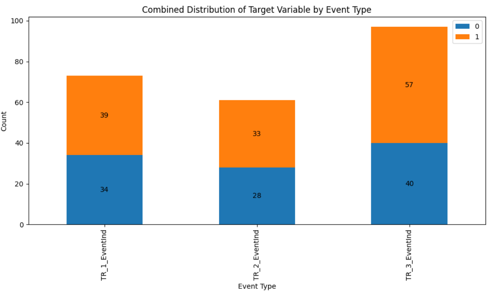

## Crypto Currency Price Prediction using PySpark

### Project Overview 
This project focuses on predicting the price of cryptocurrencies using various market indicators and search trends. The prediction is made two weeks ahead based on historical data. The project leverages PySpark for data processing and machine learning tasks.

### Dataset

**Source:** The dataset consists of 2,660 records and 78 columns, which include various market features, event indicators, and search trends.
#### Predictor Variables
- **ID:** ID of each data point (do not include in your model)
- **feature_x_y:** independent variables from the market data.
- **TR_x_EventInd:** Event that may of may not affect the crypto currencies price.
- **index_1 ~ index_3:** the search trend on specific keywords pretaining to crypto currencies.

**Target Variable:** The target variable is binary, indicating whether the price increased or decreased two weeks after the time of prediction.

- **Target:** 0 - the price dropped 2 weeks after the time of prediction 1 - the price increased 2 weeks after the time of prediction. This the target variable

### Project Structure

#### Data Ingestion:
- The data is ingested using PySpark and loaded into a Spark DataFrame.
- The schema is verified to ensure the correctness of data types.

#### Exploratory Data Analysis (EDA):
- Detailed analysis is performed to uncover insights from the data.
- Visualizations and statistical methods are used to understand the distributions, correlations, and patterns in the dataset.

#### Feature Engineering:
- Various features are engineered to enhance the predictive power of the model.
- The dataset is transformed to suit the needs of machine learning algorithms.

#### Modeling:
- Different machine learning models are applied to predict the cryptocurrency prices.
- The performance of each model is evaluated using appropriate metrics.

#### Results and Insights:
- The final model's performance is discussed.
- Key insights drawn from the predictions are presented.

This project harnesses the power of PySpark to predict fluctuations in cryptocurrency prices, achieving an accuracy rate of 76.2%. A sophisticated machine learning pipeline was created and implemented, incorporating advanced techniques such as grid search, permutation importance analysis, and model stacking. These methods were crucial in fine-tuning the hyperparameters and optimizing the model's performance. The project marked a notable improvement in accuracy, achieving an AUC score of 0.77, with the F1 score rising to 68.28% and precision reaching 76.2%, reflecting a 25% increase from the baseline. These results demonstrate the effectiveness of the implemented strategies in predicting price movements in the cryptocurrency market.

## Skills
Pyspark, Machine Learning, EDA, Big Data Analytics, Data Visualization
