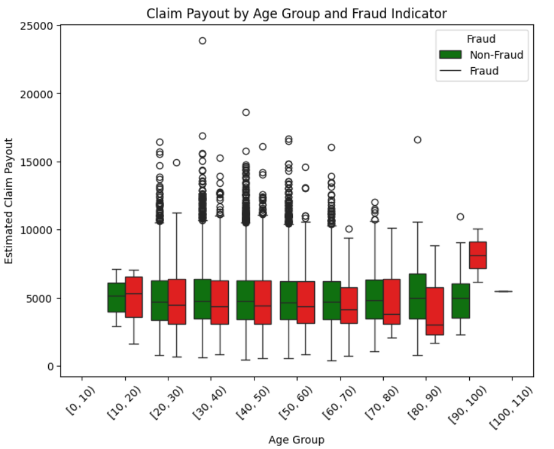
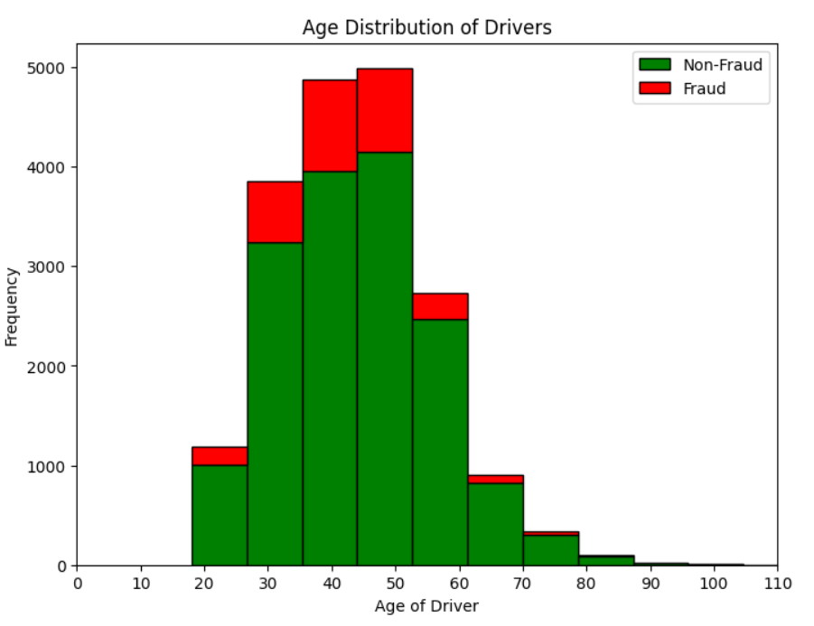

## Insurance Fraud Detection

### Project Overview
Detecting fraudulent insurance claims is critical for minimizing losses in the insurance industry. In this project, I developed a robust fraud detection system for first-party physical damage claims within the insurance sector, focusing on claims from 2015 to 2016.

### Dataset Summary
- **Source:** The dataset includes records of insurance claims referred for fraud detection.
- **Target:**
  - `fraud`: Fraud indicator (response variable)

### Tools & Technologies Employed

1. **Python Libraries:**
   - Pandas, NumPy
   - Scikit-learn
   - Matplotlib, Seaborn
   - PyCEBox for Partial Dependence Plots (PDP)

2. **Machine Learning Techniques:**
   - Data Preprocessing
   - Train-Test Split
   - Imbalanced Data Handling
   - Model Evaluation and Hyperparameter Tuning

  ### Process Flow

1. **Data Preparation:**
   - Load and explore the dataset.
   - Handle imbalanced data to ensure model accuracy.

2. **Data Analysis and Feature Selection:**
   - Identify and select key features that influence the likelihood of fraud.
   - Ensure that non-predictive features like `claim_number` are excluded.
  
     
     
3. **Model Building:**
   - Implement various classification models to detect fraud.
   - Utilize GridSearchCV for hyperparameter tuning.
   - Evaluate model performance using metrics like accuracy, precision, and recall.

4. **Results & Insights:**
   - Discuss the performance of the best model.
   - Visualize the importance of features using Partial Dependence Plots.

### Conclusion
This project showcases a systematic approach to detecting fraudulent insurance claims using machine learning. The insights gained can assist insurance companies in identifying potential fraud more effectively.

- By leveraging advanced machine learning techniques, including Random Forests and Gradient Boosting, I significantly improved detection metrics, achieving a 70% F1 score and a 60% accuracy—up from a baseline of 40%. This enhancement in fraud detection not only led to substantial cost savings but also increased customer trust by accurately identifying and preventing fraudulent claims.

